# 🚗 HamSafar – Carpool Web Platform

HamSafar is a **full-stack web application** that makes commuting easier, more affordable, and more sustainable by enabling users to **offer rides, join rides, and form regular carpool groups**.

Initially inspired by the transportation challenges faced by university students with varying schedules, HamSafar can serves **anyone** seeking flexible, cost-effective travel solutions.

---

## 🌟 Features

### **User Roles**

- 🚘 **Driver** – Offer rides by scheduling trips.
- 🧍 **Passenger** – Search and join rides based on preferences.

### **Ride Management**

- Schedule one-time or recurring rides.
- View trip details including **route, distance, and estimated time**.
- Join trips instantly if seats are available.

### **Interactive Maps**

- Powered by **Mapbox API** & **OpenStreetMap**.
- Live route display with pickup & drop-off points.

### **Friends Group Carpool**

- Create or join **Friends Groups** for regular commutes.
- Add or remove group members easily.

### **Ratings & Reviews**

- Rate trips and leave driver reviews.
- View your trip rating history.

### **Real-Time Notifications**

- Live updates for trip requests, acceptances, and group invites via **Axios** polling.

### **Profile & Settings**

- Edit profile information.
- Change password and update preferences.
- Toggle **Dark Theme** for better user experience.
- Delete or deactivate your account.

### **Admin Actions**

- Approve or reject trips.
- Manage reported users and flagged trips.

### **Authentication & Security**

- **JWT-based Authentication** for secure sessions.

### **Database & Backend Logic**

- **Microsoft SQL Server** with fully normalized schema.
- Optimized queries, stored procedures, and triggers.

### **Payment System**

- Manual payments (future integration with online payment gateways planned).

---

## 🛠 Tech Stack

### **Frontend**

- React.js
- Tailwind CSS
- Axios

### **Backend**

- Node.js + Express.js
- JWT Authentication
- SQL Server (MS SQL)
  - Stored Procedures
  - Triggers
  - Normalized schema

### **Maps & Geolocation**

- Mapbox API
- OpenStreetMap

---


```plaintext
📂 Project Structure
HamSafar/
├── backend/
│   ├── controllers/       # Business logic
│   ├── models/            # Data models
│   ├── routes/            # API routes
│   ├── db.js              # DB connection
│   ├── server.js          # Backend entry
│   └── .env               # Environment variables
│
├── frontend/
│   ├── public/
│   │   ├── assets/        # Logos & static assets
│   │   ├── images/        # App images
│   ├── src/
│   │   ├── components/    # Pages & UI components
│   │   ├── App.js         # App shell & routing
│   │   └── index.js
│
├── screenshots/           # App screenshots
└── README.md
```


## ⚙️ Environment Variables


```env
DB_USER
DB_PASSWORD
DB_SERVER
DB_DATABASE
DB_ENCRYPT
DB_TRUST_CERT
````

---

## 🚀 Getting Started

### **1️⃣ Clone the Repository**

```bash
git clone https://github.com/Asra-Bukhari/hamsafar.git
cd hamsafar
```

### **2️⃣ Backend Setup**

```bash
cd backend
npm install
```

- Create `.env` file (see above)
- Start the server:

```bash
npm start
```

### **3️⃣ Frontend Setup**

```bash
cd frontend
npm install
npm start
```

---

## 📸 Visuals

| Logo Page                          | signup Page                            | Driver Reg                                    |
| ---------------------------------- | -------------------------------------- | --------------------------------------------- |
| 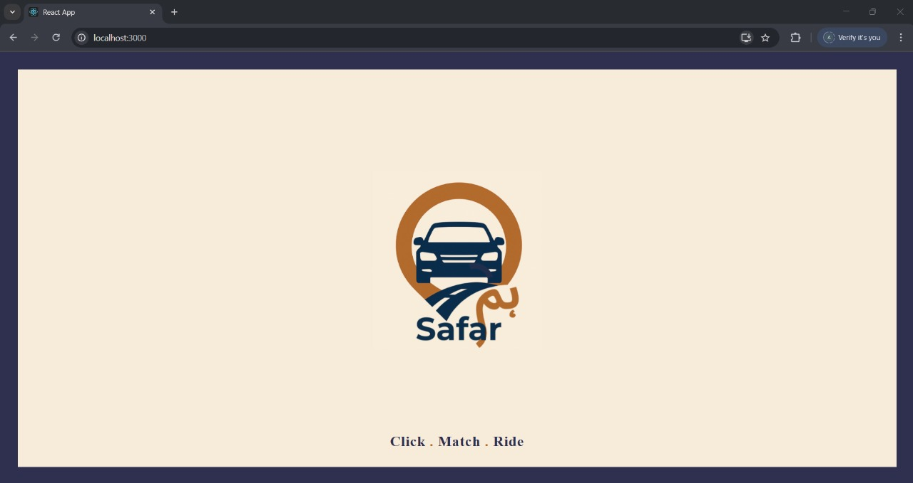 | 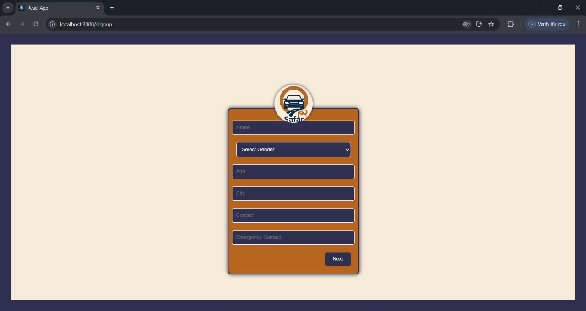 | 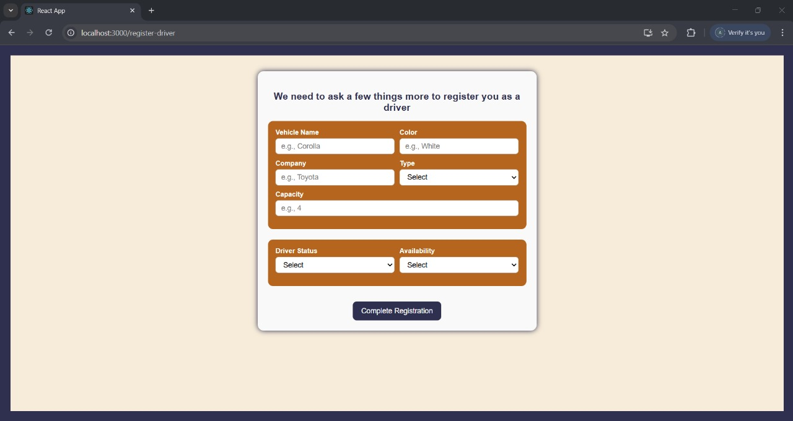 |

| Login Page                           | Home Page                          | Schedule Trip                              |
| ------------------------------------ | ---------------------------------- | ------------------------------------------ |
| 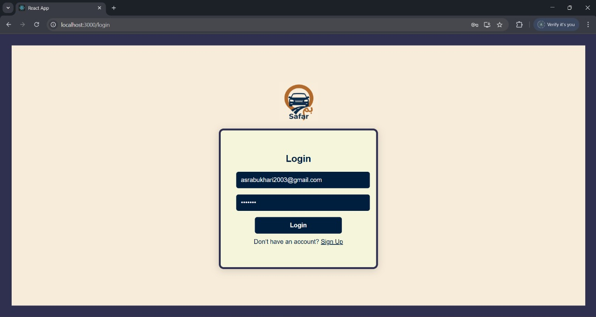 | 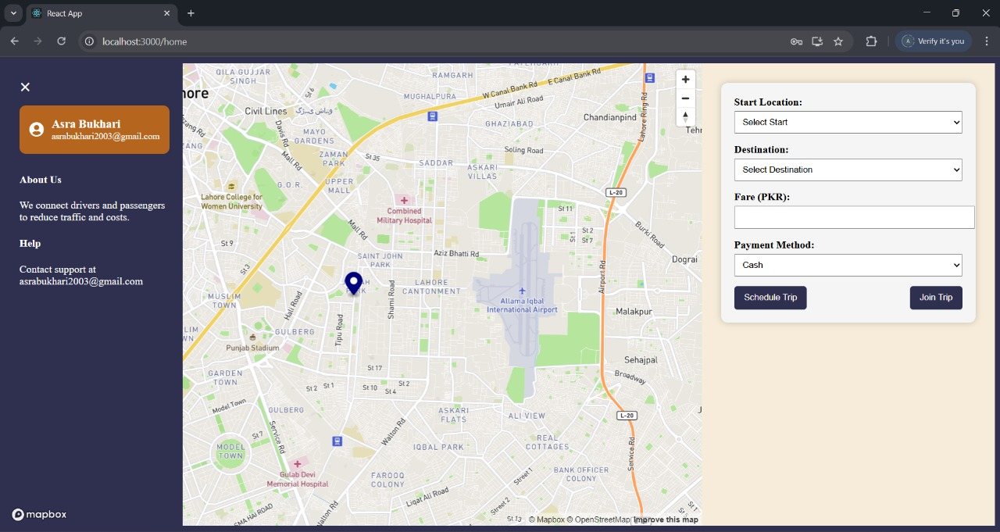 | 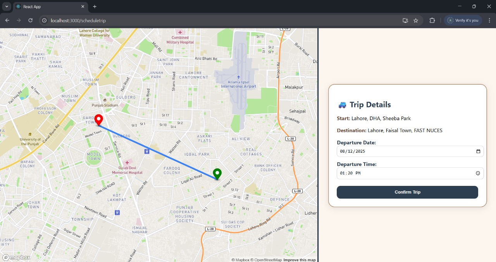 |

| Join Trip                          | Friends Group                                  | Profile Page                             |
| ---------------------------------- | ---------------------------------------------- | ---------------------------------------- |
| 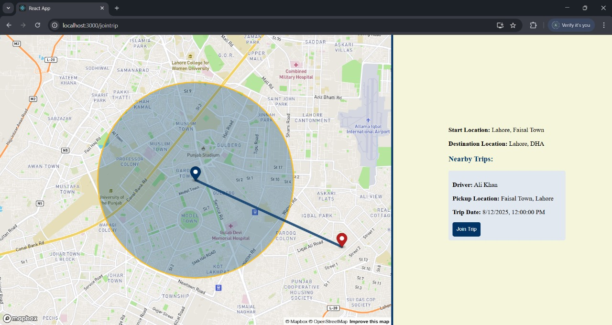 | 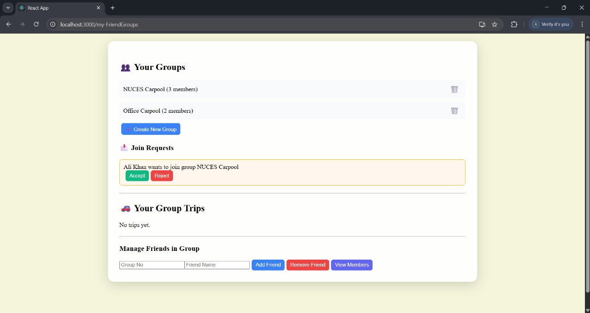 | 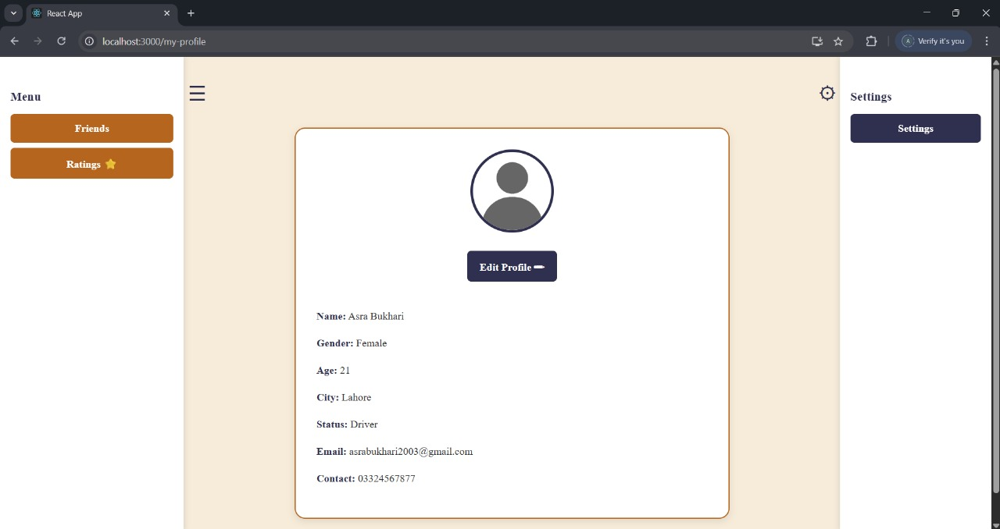 |

| Accept Requests                                    | Ratings                             | Notifications                                   |
| -------------------------------------------------- | ----------------------------------- | ----------------------------------------------- |
| 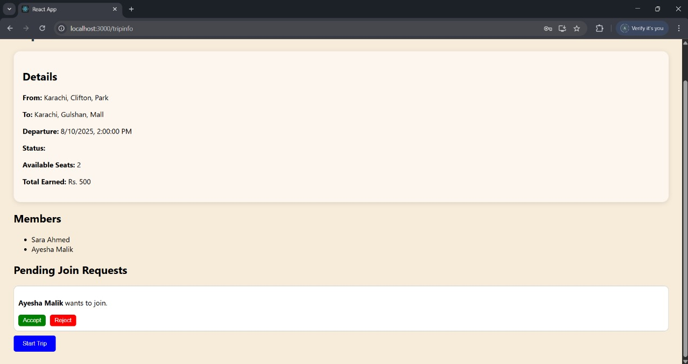 | 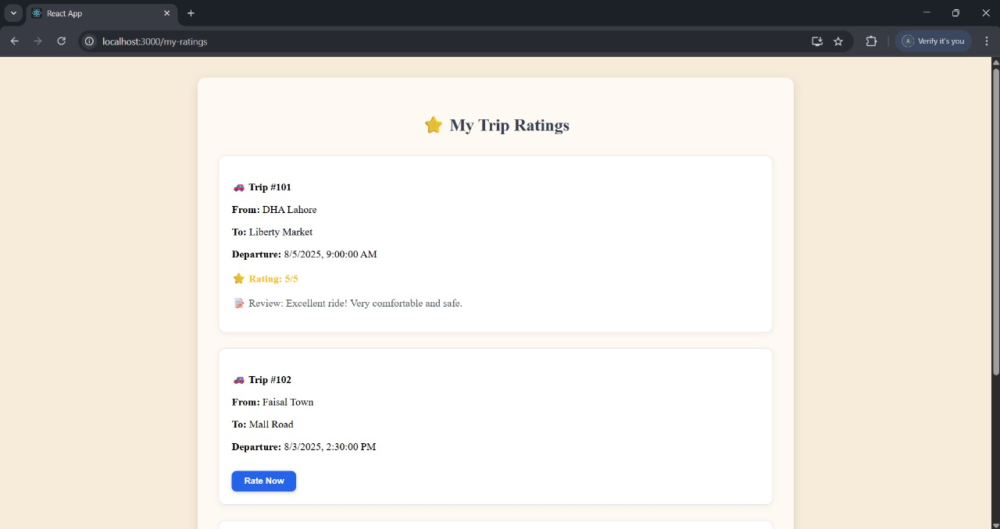 | 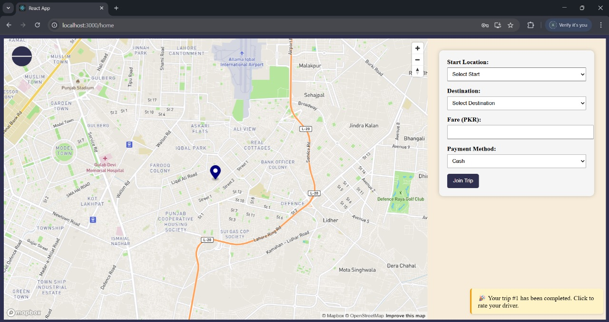 |

## 💡 Future Improvements

- Online payment integration (Stripe/PayPal)
- AI-based ride matching

---

## 👩‍💻 Authors

**Asra Bukhari**
**Shizza Razzaq**
**Muhammad Harmain**
